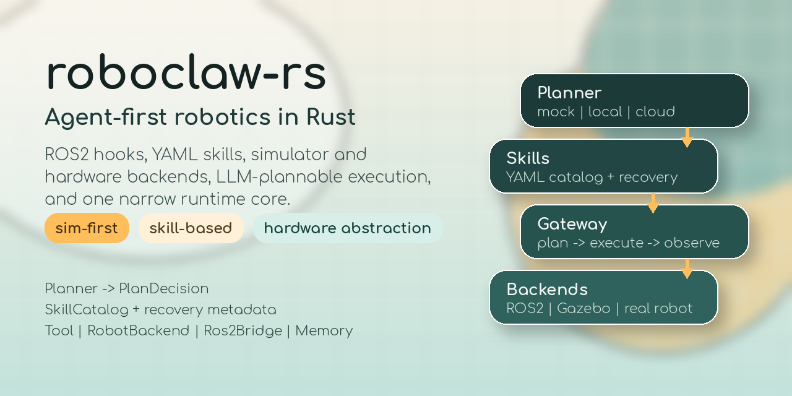

# roboclaw-rs



`roboclaw-rs` is a Rust-first, agent-first robotics workspace that unifies simulator and real robot control behind the same interfaces. The current implementation is intentionally minimal: it boots an OpenClaw-inspired agent loop, loads YAML skills dynamically, persists memory to disk, and runs a pick-and-place demo against a simulator backend.

Tagline: Agent-first robotics workspace in Rust with ROS 2 hooks, YAML skills, simulator and hardware backends, and LLM-plannable execution.

Website: `https://rsasaki0109.github.io/roboclaw-rs/`

## Goals

- Rust implementation
- ROS 2 integration points
- OpenClaw-style gateway and agent layering
- Same API for simulation and hardware
- LLM-plannable skill execution
- Sim-first, hardware-abstracted design

## Current Status

- The repo now works as an experiment-driven robotics workspace, not just a single fixed implementation.
- End-to-end demos, recovery flows, ROS2 bridge selection, local/remote planner adapters, and generated decision docs are already wired.
- Design exploration lives under `experiments/`; the runtime-facing core stays intentionally narrow.

## Workspace Layout

```text
roboclaw-rs/
├── experiments/
│   ├── artifact_mirroring_drift/
│   ├── artifact_trust_decay/
│   ├── cross_repo_provenance_stitching/
│   ├── cross_provider_validation/
│   ├── cross_suite_contradiction/
│   ├── cross_train_lag_carryover/
│   ├── frontier_snapshot_replay/
│   ├── planner_selection/
│   ├── provenance_lag_budgets/
│   ├── provenance_backfill/
│   ├── promotion_environment_provenance/
│   ├── promotion_provenance/
│   ├── promotion_rules/
│   ├── planner_prompt_shaping/
│   ├── recovery_skill_patterns/
│   ├── rollback_rules/
│   ├── ros2_observation_ingestion/
│   ├── surface_lag_budget_calibration/
│   ├── resume_policy/
│   ├── gateway_replanning/
│   ├── backend_observation_fusion/
│   └── tool_output_validation/
├── crates/
│   ├── gateway/
│   ├── agent/
│   ├── skills/
│   ├── tools/
│   ├── memory/
│   ├── ros2/
│   └── sim/
├── examples/
├── docs/
├── prompts/
├── skills/
└── README.md
```

## Architecture

### Gateway

`roboclaw-gateway` is the hub. It owns the agent, skill catalog, and ROS2 bridge, and publishes state/action messages on:

- `/cmd_vel`
- `/joint_states`
- `/roboclaw/action`
- `/roboclaw/state`

### Agent

```rust
pub struct Agent {
    pub memory: Memory,
    pub planner: Box<dyn Planner>,
    pub executor: Executor,
}
```

The runtime loop is:

1. Receive instruction
2. Plan with the planner
3. Select a YAML skill
4. Execute tool-backed steps
5. Persist memory
6. Produce next action

### Skills

Skills are YAML files in `skills/` and are loaded dynamically at runtime.

```yaml
name: pick_and_place
description: pick up an object in simulation and place it into a bin
steps:
  - name: detect_object
    tool: sensor
    max_retries: 1
    input:
      target: red_cube
    expect:
      detected: true
      target: "$input.target"
```

Recovery skills can declare routing metadata in the same YAML:

```yaml
name: recover_grasp
description: recover from a failed grasp
resume_original_instruction: true
recovery_for:
  - failed_steps:
      - grasp
    tools:
      - motor_control
```

Each step can declare:

- `input`: tool payload
- `expect`: observation contract matched against the tool output
- `max_retries`: retry budget before the agent returns `replan_after_<step>`
- `resume_from_step`: checkpoint step to resume from after recovery, defaulting to the failed step itself

Each skill can also declare:

- `resume_original_instruction`: when `true`, the gateway runs the skill as recovery work and then returns to the original instruction
- `supports_checkpoint_resume`: when `true`, the gateway may resume the skill from the failed step after recovery
- `recovery_for`: declarative routing rules for recovery skills, matched against failed step name, tool name, and observation text

Current bootstrap skills:

- `pick_and_place`
- `recover_grasp`
- `recover_observation`
- `wave_arm`

### Tools

Tools implement a common interface:

```rust
pub trait Tool: Send + Sync {
    fn name(&self) -> &str;
    fn execute(&self, input: serde_json::Value) -> anyhow::Result<serde_json::Value>;
}
```

The workspace currently includes:

- `MotorControlTool`
- `SensorTool`
- `SimulatorTool`

### Memory

Memory is file-based:

- short-term: `short_term.json`
- long-term: `long_term.md`

This keeps the implementation simple while matching the OpenClaw-style preference for inspectable logs.

### Simulation and Hardware Abstraction

`roboclaw-sim` defines:

```rust
pub trait RobotBackend: Send + Sync {
    fn name(&self) -> &str;
    fn send_command(&self, cmd: Command) -> anyhow::Result<BackendAck>;
    fn current_state(&self) -> RobotState;
}
```

Current backends:

- `GazeboBackend`
- `RealRobotBackend`

Both share the same command API. The demo uses `GazeboBackend`.

### LLM Integration

The planner reads its prompt from `prompts/planner_prompt.txt`. The workspace now includes:

- `OpenAi`
- `Claude`
- `Local`
- `Mock`

All non-mock planners use the same strict skill-selection contract:

- the skill catalog is converted into a JSON Schema at runtime
- the schema constrains `skill` to the loaded skill names
- recovery-planning turns may further narrow `skill` to matching recovery skills only
- the planner must return exactly one skill selection

Provider implementations:

- `Local`: Ollama `/api/generate` with a JSON schema response format
- `OpenAi`: Responses API with `text.format.type = json_schema`
- `Claude`: Messages API with strict client tool use
- `Mock`: deterministic fallback planner for offline bootstrapping

Planner selection is environment-driven through `ROBOCLAW_LLM_PROVIDER`:

- `auto` (default): prefer `local`, then `openai`, then `claude`, then `mock`
- `local`
- `openai`
- `claude`
- `mock`

Relevant environment variables:

- `ROBOCLAW_LLM_PROVIDER`
- `ROBOCLAW_OLLAMA_HOST`
- `ROBOCLAW_OLLAMA_MODEL`
- `OPENAI_API_KEY` or `ROBOCLAW_OPENAI_API_KEY`
- `ROBOCLAW_OPENAI_MODEL`
- `ANTHROPIC_API_KEY` or `ROBOCLAW_CLAUDE_API_KEY`
- `ROBOCLAW_CLAUDE_MODEL`

## Experiment-Driven Development

This repository now treats design as an evolving search space instead of a single abstraction to perfect up front.

- Stable core lives under `crates/`, `skills/`, and the runtime examples.
- Experimental variants live under `experiments/`.
- The case set, evaluation harness, and decision docs are regenerated together.

### Stable Core Now

The current narrow core is:

- `roboclaw_agent::Planner -> PlanDecision`
- `roboclaw_skills::SkillCatalog`
- YAML skills and recovery metadata such as `expect`, `max_retries`, `resume_from_step`, `recovery_for`, `resume_original_instruction`, and `supports_checkpoint_resume`
- `roboclaw_tools::Tool`
- `roboclaw_sim::RobotBackend`
- `roboclaw_ros2::Ros2Bridge`
- `roboclaw_memory::Memory`
- the orchestration loop: `instruction -> plan -> execute -> observe -> memory -> resume/replan`

Policy winners from experiments such as prompt shaping, reducer choice, provenance budgets, rollback budgets, and lag calibration are intentionally kept outside the stable runtime API.

Current experiment suites:

- `cross_provider_validation`: validate the current planner frontier across provider adapters
- `cross_repo_provenance_stitching`: how release provenance should be stitched when changelog and release-note evidence is split across repositories
- `cross_suite_contradiction`: detect when local suite frontiers and promotion policy disagree
- `cross_train_lag_carryover`: whether unresolved publication lag should continue, resolve, or block across release cuts
- `frontier_snapshot_replay`: replay versioned provider/model evidence before promoting a provisional frontier
- `planner_selection`: which YAML skill to choose for an instruction
- `artifact_mirroring_drift`: how mirrored publication surfaces should drift when package registries and docs portals fall out of sync
- `provenance_lag_budgets`: how staggered registry/feed/docs updates should stay pending, supersede, or block provenance changes
- `artifact_trust_decay`: how artifact trust should fall off when changelog, release notes, and rollback notes disagree across release trains
- `provenance_backfill`: whether missing release provenance can be safely reconstructed from changelog and release-note artifacts
- `promotion_environment_provenance`: whether a promoted runtime surface still has coherent provenance across deployment environments
- `promotion_provenance`: whether a promoted runtime surface still has a continuous documented release lineage
- `promotion_rules`: when an experimental frontier is mature enough to move into the stable runtime
- `planner_prompt_shaping`: how planner prompt text and schema constraints should be presented
- `recovery_skill_patterns`: what kind of recovery sequence should run after each failure shape
- `rollback_rules`: when a previously promoted runtime surface should stay, roll back, or be replaced
- `ros2_observation_ingestion`: how ROS2 topic streams should reduce into replanning context
- `surface_lag_budget_calibration`: how each publication surface should calibrate its own lag budget from observed traces
- `resume_policy`: which step to resume from after recovery
- `gateway_replanning`: what the gateway loop should do after success, failure, or completed recovery
- `backend_observation_fusion`: how backend state and sensor observations should be merged before replanning
- `tool_output_validation`: how `expect` contracts should match tool outputs before retry or replan

Every suite uses the same rules:

- same input set for all variants in the suite
- same minimal interface for all variants in the suite
- same generated metrics for all variants in the suite

Run the experiment loop and regenerate docs:

```bash
./scripts/run_planner_experiments.sh
```

Or directly:

```bash
cargo run --example planner_experiments -- --write-docs
```

## GitHub Metadata

- About description: `Rust-first, agent-first robotics workspace with ROS 2 hooks, YAML skills, simulator/hardware backends, and LLM-plannable execution.`
- About homepage: `https://rsasaki0109.github.io/roboclaw-rs/`
- GitHub Pages: `https://rsasaki0109.github.io/roboclaw-rs/`
- Social preview asset: `docs/assets/github-social-preview.png`
- GitHub UI path for upload: `Settings -> General -> Social preview`

This updates:

- `docs/experiments.md`
- `docs/decisions.md`
- `docs/interfaces.md`

### ROS 2

The `roboclaw-ros2` crate exposes ROS2 topic names and a bridge abstraction. `rclrs` is wired behind the optional `ros2` feature so the default build remains runnable in environments without a full ROS 2 installation.

Bridge selection is controlled with:

- `ROBOCLAW_ROS2_BRIDGE=mock`
- `ROBOCLAW_ROS2_BRIDGE=rclrs`

Default builds stay on `mock`. To force the real `rclrs` transport, build with `--features ros2` and set `ROBOCLAW_ROS2_BRIDGE=rclrs`.

## Demo

Run the end-to-end simulator demo:

```bash
cargo run --example pick_and_place
```

Pass the instruction from the command line:

```bash
cargo run --example pick_and_place -- "Pick up the red cube and place it in bin_a."
```

Or via environment variable:

```bash
ROBOCLAW_INSTRUCTION="Pick up the red cube and place it in bin_a." cargo run --example pick_and_place
```

The demo resolves planners automatically. In the current implementation, `auto` prefers Ollama if a local generative model is available.

To force local planning through Ollama, set:

```bash
ROBOCLAW_LLM_PROVIDER=local ROBOCLAW_OLLAMA_MODEL=llama3.2:1b cargo run --example pick_and_place
```

To force OpenAI planning:

```bash
ROBOCLAW_LLM_PROVIDER=openai OPENAI_API_KEY=... cargo run --example pick_and_place
```

To force Claude planning:

```bash
ROBOCLAW_LLM_PROVIDER=claude ANTHROPIC_API_KEY=... cargo run --example pick_and_place
```

To force deterministic offline behavior:

```bash
ROBOCLAW_LLM_PROVIDER=mock cargo run --example pick_and_place
```

To demo automatic recovery after a failed observation, inject transient sensor misses:

```bash
ROBOCLAW_LLM_PROVIDER=mock ROBOCLAW_SENSOR_FAIL_COUNT=2 cargo run --example pick_and_place
```

To demo checkpoint resume after a grasp failure, inject transient motor stalls:

```bash
ROBOCLAW_LLM_PROVIDER=mock ROBOCLAW_MOTOR_FAIL_COUNT=2 cargo run --example pick_and_place
```

Compare providers on the same instruction:

```bash
cargo run --example compare_planners -- --providers mock,local "Pick up the red cube and place it in bin_a."
```

Compare providers on a canned recovery-planning scenario:

```bash
cargo run --example compare_planners -- --providers mock,local --scenario recover-grasp
```

Inspect the exact prompt and schema used for that recovery turn:

```bash
cargo run --example compare_planners -- --providers mock --scenario recover-grasp --debug
```

You can also compare remote planners if keys are configured:

```bash
ROBOCLAW_COMPARE_PROVIDERS=mock,local,openai,claude cargo run --example compare_planners
```

The example:

- loads the YAML skill catalog
- loads an external planner prompt
- builds the agent and gateway
- selects a skill through a provider-agnostic planner interface
- executes a pick-and-place instruction through tools
- validates each step against YAML expectations and retries when configured
- prints the resulting simulator state and ROS2 messages

`compare_planners` runs the same instruction through multiple planners and prints the selected skill plus planner reason or provider-specific error. It compares planning decisions only and does not execute robot actions. `--scenario recover-grasp` and `--scenario recover-observation` generate canonical failure contexts so you can inspect recovery skill selection without running the full gateway loop.

## Development

Format and run:

```bash
cargo fmt
cargo run --example pick_and_place
```

Ollama setup example:

```bash
ollama pull llama3.2:1b
ROBOCLAW_LLM_PROVIDER=local ROBOCLAW_OLLAMA_MODEL=llama3.2:1b cargo run --example pick_and_place
```

Optional ROS 2 bridge feature:

```bash
cargo check --features ros2
```

Run the end-to-end demo through the real `rclrs` transport:

```bash
ROBOCLAW_ROS2_BRIDGE=rclrs cargo run --features ros2 --example pick_and_place
```

Or use the helper script, which sources ROS 2 and applies a local linker workaround if `test_msgs` is missing on the machine:

```bash
./scripts/run_pick_and_place_ros2.sh
./scripts/run_pick_and_place_ros2.sh "Pick up the red cube and place it in bin_a."
```

Notes:

- `cargo check --workspace --features ros2` is verified in this repo.
- Running or testing with `--features ros2` links against the system ROS 2 installation.
- Some `rclrs` builds require `ros-$ROS_DISTRO-test-msgs`. If those shared libraries are missing, `cargo test --workspace --features ros2` will fail at link time.
- The helper script creates temporary stub `test_msgs` libraries under `target/ros2-stubs` only to unblock local demo execution in that case. Install the real ROS 2 package for a clean environment.

## Demo Video

This repository now includes helper scripts for terminal-based demo recording:

```bash
./scripts/prepare_demo.sh
./scripts/demo_terminal.sh
./scripts/record_demo.sh
./scripts/render_demo_video.sh
```

Production notes, shot lists, and narration scripts live in:

```bash
docs/demo_video.md
```

Profile guidance:

- `DEMO_PROFILE=short`: 25-35 second cut
- `DEMO_PROFILE=full`: 60-90 second cut

Recommended flow:

1. Open a dedicated terminal sized for recording.
2. Optionally warm the local model with `./scripts/prepare_demo.sh`.
3. Start recording with `./scripts/record_demo.sh`.
4. Click the terminal window when `xwininfo` asks.
5. In a second terminal, run `./scripts/demo_terminal.sh`.
6. Return to the recording terminal and press `q` to stop `ffmpeg`.

Useful variants:

```bash
./scripts/prepare_demo.sh
ROBOCLAW_LLM_PROVIDER=local ROBOCLAW_OLLAMA_MODEL=llama3.2:1b ./scripts/demo_terminal.sh
DEMO_PROFILE=short ./scripts/demo_terminal.sh
DEMO_PROFILE=full ./scripts/demo_terminal.sh
DEMO_REQUIRE_LOCAL=1 DEMO_PROFILE=short ./scripts/demo_terminal.sh
./scripts/render_demo_video.sh target/roboclaw-demo-preview.mp4
./scripts/record_demo.sh target/roboclaw-demo.mp4
FPS=60 CRF=20 ./scripts/record_demo.sh
```

`demo_terminal.sh` plays a short sequence suitable for narration:

- provider comparison on pick-and-place
- end-to-end pick-and-place execution
- mock-planned wave execution
- provider comparison on wave

It also prints scene headers and short guidance lines before each section so the capture is easier to narrate directly from the terminal output.

If you want a ready-made script and shot list for narration, use `docs/demo_video.md`.

## Next Extensions

- Add typed ROS 2 publishers and subscribers for command and state messages
- Introduce richer skill step conditions, retries, and branching
- Add world model updates from sensor streams
- Add Isaac Sim backend alongside Gazebo
- Support action servers, navigation, and manipulation pipelines
- Persist vectorized long-term memory and skill execution traces
